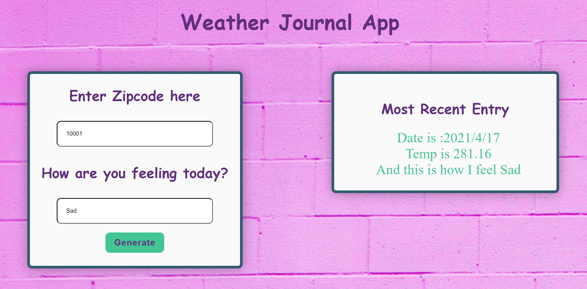

# Weather-Journal App Project
3th project at [Udacity](https://www.udacity.com/course/front-end-web-developer-nanodegree--nd0011) Front End Web Development Nanodegree program.

## Overview
This project requires you to create an asynchronous web app that uses Web API and user data to dynamically update the UI. 

## Building Tools
* HTML, CSS, JavaScript, Node.js, Express, and OpenWeatherMap API.

## Instructions
This will require modifying the `server.js` file and the `website/app.js` file. You can see `index.html` for element references, and once you are finished with the project steps, you can use `style.css` to style your application to customized perfection.

## Setup your Environment
* Check Node.js `node -v`.
* Check Node.js `npm -v`.
* Install Dependency `npm install` , `package-lock.json` file  and `node_modules` folder will appear.
* Install Express `npm install express` , `package.json` file will appear.
* Install Body-parser `npm install body-parser`.
* Install Cors `npm install cors`.
* Edit `website\app.js` add OpenWeatherMap API to `const theKey = '&appid=';` after the `=` symbol.
* Start Server `node .\server.js`.

## Screenshots

## Useful Links
* [OpenWeatherMap API](https://openweathermap.org/api)
* [Background](https://unsplash.com/)
* [Image Color Picker](https://imagecolorpicker.com/en)
* [Markdown Live Preview For readme gile](https://markdownlivepreview.com/)

## Author
Norah Suhail.
